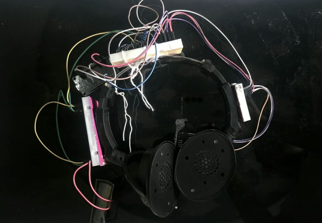

# ProjectPrayoga--Silent-Speech-Recognition
# Project Prayoga

### Wearable Silent Speech Recognition Using IMU and Piezoelectric Sensing

SilentSpeak is a wearable silent-speech recognition prototype that uses subtle jaw and facial movements and mechanical vibrations to recognize intended phrases without audible speech.

The current prototype uses an **ESP32**, **MPU6050 IMU**, and **piezoelectric sensor**, combined with machine learning to classify a small set of phrases.

**Current phrases:** `HELLO` · `YES` · `NO` · `I NEED WATER` · `I NEED HELP`

---

## Prototype

<p align="center">
  
</p>

*Current ProjectPrayoga hardware prototype.*

---

## How It Works

ProjectPrayoga captures subtle motion and mechanical vibrations produced during silent articulation.

The **MPU6050** captures motion using its accelerometer and gyroscope, while the **piezoelectric sensor** captures mechanical vibrations around the jaw/face region.

The ESP32 collects the sensor data, which is then processed into statistical and temporal features. These features are passed to a machine-learning model to identify the intended phrase.

---

## Hardware

| Component                         | Purpose                                   |
| --------------------------------- | ----------------------------------------- |
| ESP32                             | Main microcontroller and sensor interface |
| MPU6050                           | Measures acceleration and angular motion  |
| Piezoelectric sensor              | Captures mechanical vibrations            |
| Piezo signal-conditioning circuit | Biases and protects the analog signal     |

### Connections

**MPU6050 → ESP32**

| MPU6050 | ESP32   |
| ------- | ------- |
| VCC     | 3.3V    |
| GND     | GND     |
| SDA     | GPIO 21 |
| SCL     | GPIO 22 |

**Piezoelectric Sensor → ESP32**

| Piezo circuit | ESP32   |
| ------------- | ------- |
| Analog output | GPIO 34 |
| GND           | GND     |

---

## Machine Learning

The sensor recordings are converted into **153 features** containing statistical and temporal information from the sensor signals.

The project currently evaluates:

* Support Vector Machine (SVM)
* Random Forest

The **Random Forest model** is currently used for live prediction.

---

## Dataset

The dataset contains recordings for five phrases:

| Phrase       | Label          |
| ------------ | -------------- |
| Hello        | `HELLO`        |
| Yes          | `YES`          |
| No           | `NO`           |
| I need water | `I_NEED_WATER` |
| I need help  | `I_NEED_HELP`  |

Each recording contains approximately **3 seconds of sensor data**, sampled at approximately **10 ms intervals**.

---

## Live Learning

ProjectPrayoga includes a human-in-the-loop learning system.

During live operation, the system:

1. Records a new sensor sample.
2. Predicts the intended phrase.
3. Provides the predicted phrase as audible output.
4. Asks the user to confirm the prediction.
5. Saves the corrected label when necessary.
6. Adds the new recording to the dataset.
7. Retrains the machine-learning model.

This allows the system to continuously expand its training data during development.

---

## Live Prediction

The current prototype provides audible feedback using text-to-speech.

For example, if the model predicts:

**`I_NEED_WATER`**

the system produces the spoken output:

**"I need water."**

---

## Running the Project

### Install Python Dependencies

```bash
pip install numpy pandas scikit-learn joblib pyserial pyttsx3 matplotlib
```

### Train the Model

```bash
python train_model.py
```

### Run Live Learning

Connect the ESP32 and run:

```bash
python live_learning.py
```

---

## Current Status

**Prototype — Active Development**

The current prototype demonstrates:

* ESP32-based sensor acquisition
* MPU6050 motion sensing
* Piezoelectric vibration sensing
* Automated dataset collection
* Machine-learning classification
* Live phrase prediction
* Human-in-the-loop learning
* Automatic model retraining
* Audible prediction output

---

## Limitations

The current system is still an experimental prototype.

Recognition performance can vary depending on:

* Sensor placement
* User
* Head and jaw movement
* Articulation style
* Amount of training data

The current vocabulary is also limited to five phrases.

---

## Future Development

Future work will focus on:

* Expanding the phrase vocabulary
* Collecting more data from multiple users
* Improving recognition accuracy
* Personalized calibration
* More compact wearable hardware
* Standalone ESP32 inference
* Portable audio output
* Real-time continuous recognition

---

## Author

**Sathvika Cheripally**

ProjectPrayoga was developed as a wearable silent-speech recognition prototype for hackathon and research exploration.
